# 靶机base64_WP

环境：kali linux
难度：baby

## 1. 端口探测

``` bash
nmap -Pn -sC -sV -n -p- 10.202.240.5
```

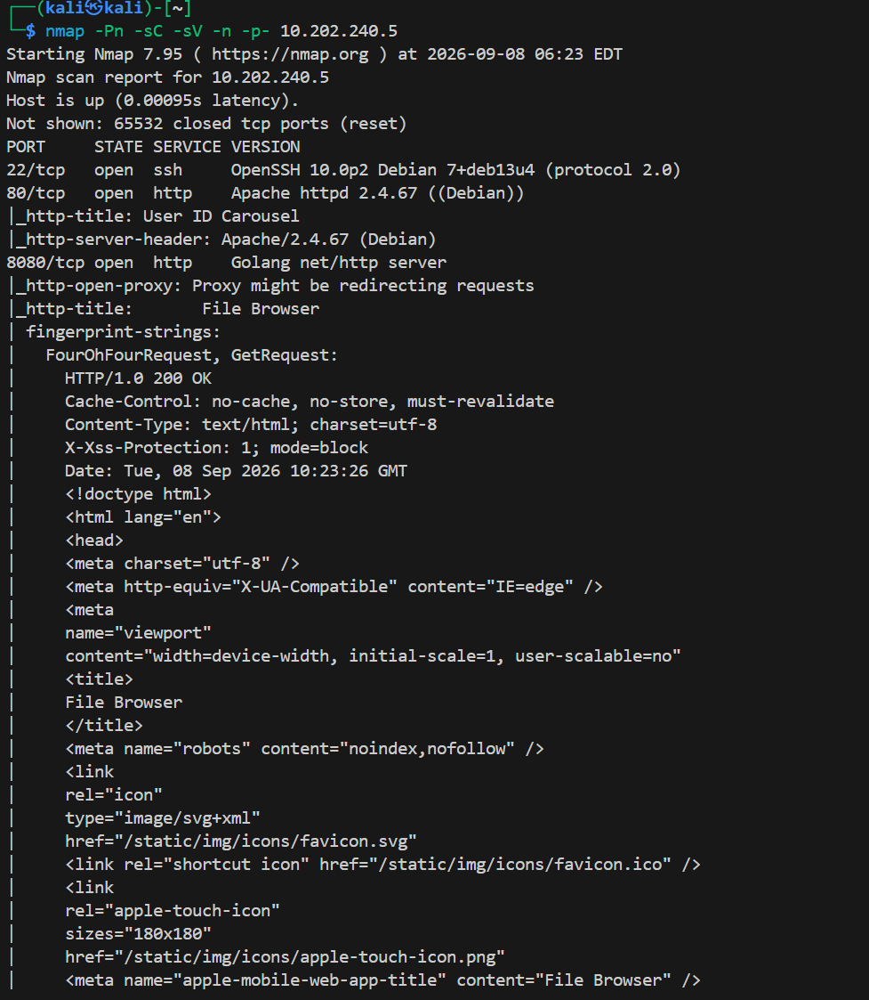

开放了22、80、8080端口，80端口名为用户ID轮播，8080端口是File Browser，是一个用Go语言编写的轻量级文件管理界面，常用于服务器运维

## 2. 访问80端口web页面找线索

访问http://10.202.240.5寻找线索

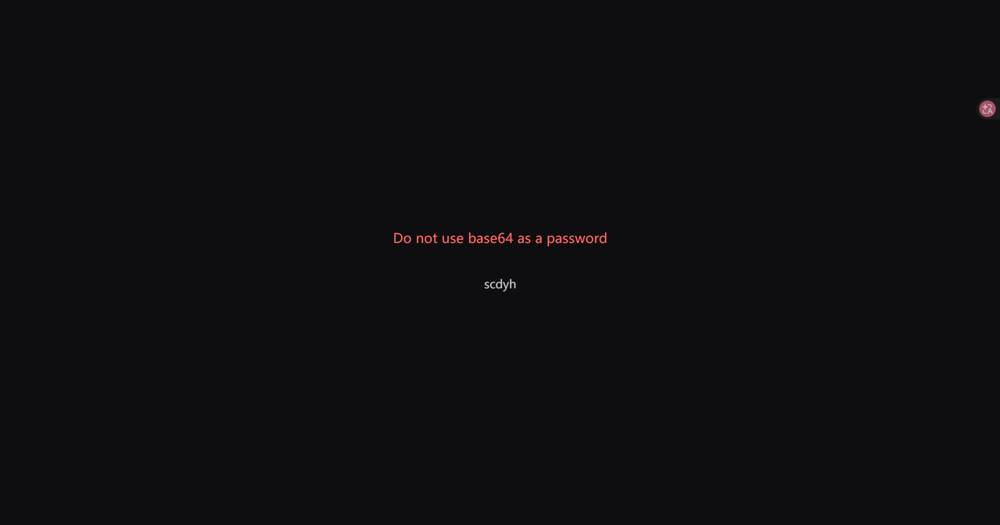

页面显示为不要用base64作为一个密码，下面还在轮播很多群友的qq名

查看一下源代码

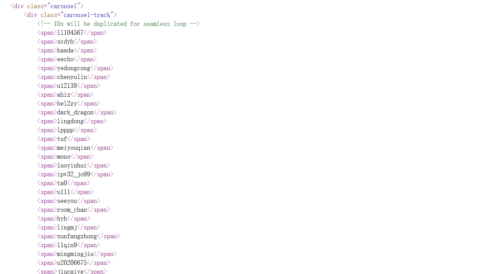

发现其将所有qq名都放到源码且放了两遍

使用dirsearch再找找看有没有线索

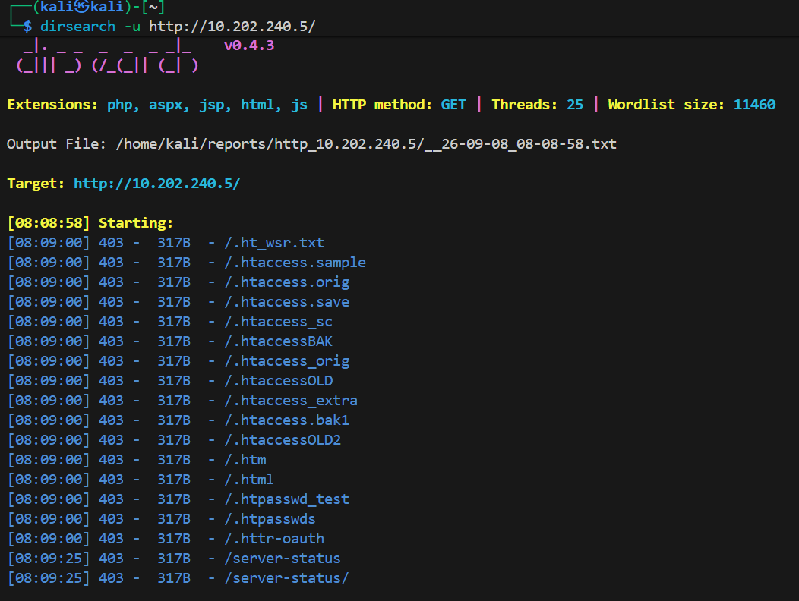

没有任何有效路径

## 3. 访问8080端口的web页面找线索

发现一个登录页面

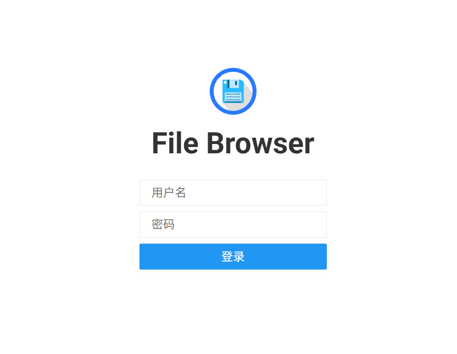

先用dirsearch扫描一下看看有没有隐藏路径有提示用户名密码

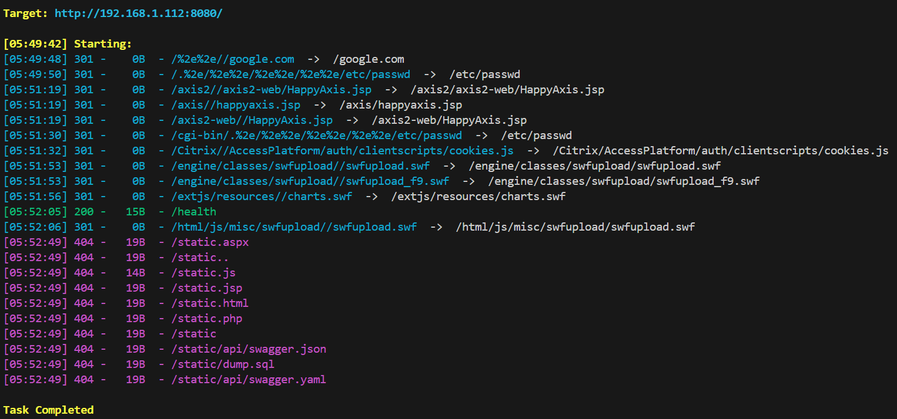

有个/health路径，点进去看看

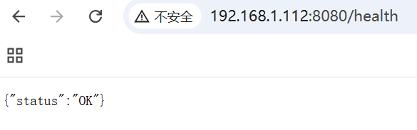

没任何信息

查看了一下源代码，发现没有啥线索，但是登录联想到刚刚给出的密码不能是base64，再加上给出的qq名，可以试试用qq名作用户名，其base64作为密码登录

抓包爆破（这里的recaptcha不用填写的原因是前端HTML中写有"ReCaptcha":false）.发现刚刚的爆破假设没有成功，又试了几种搭配，使用qq名的base64来作为用户名和密码，使用常见用户名和base64的qq名作为用户名和密码，使用第三种方案成功爆出

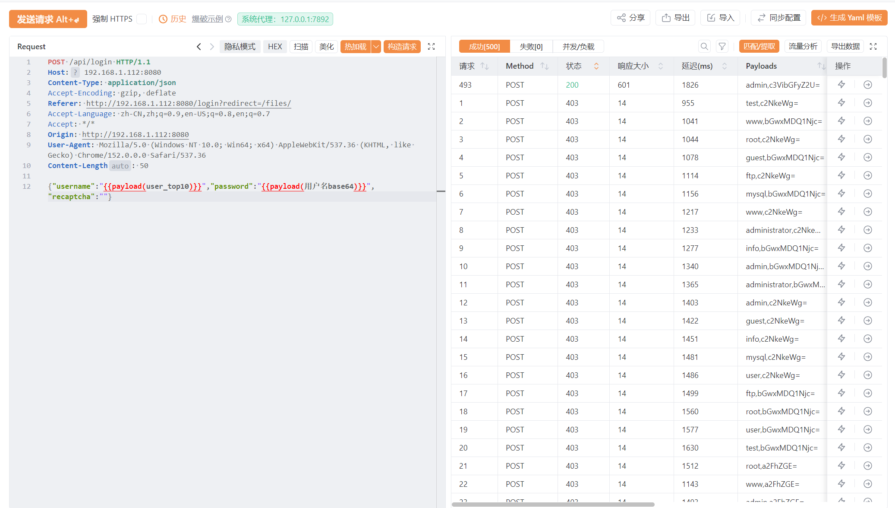

用户名：`admin`
密码：`c3VibGFyZ2U=`(sublarge的base64)

## 4. 利用泄露的数据库文件信息获取user shell

使用用户名和密码登录成功后，进入页面

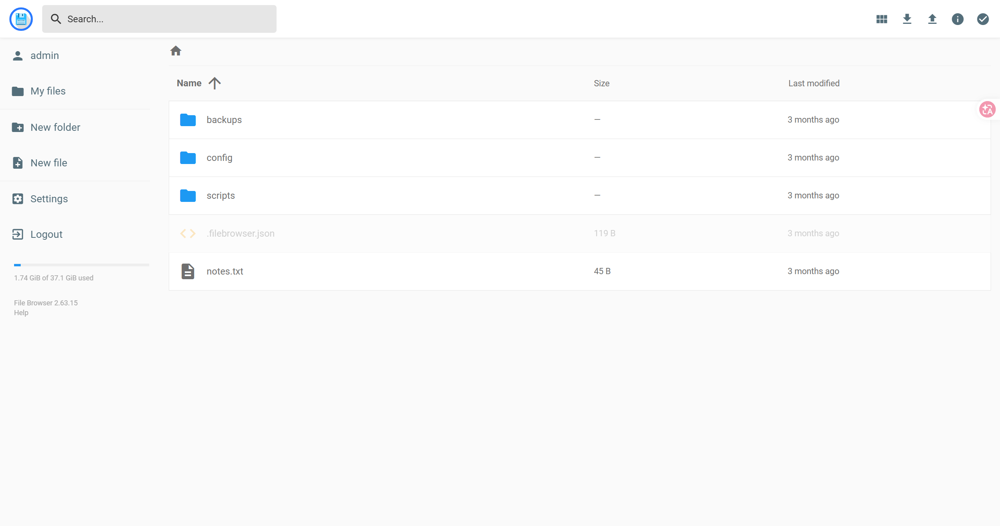

在notes.txt中发现一个todo写了修改root密码，可能还没做，当前 root 密码可能就是这个 admin12345678，先记着

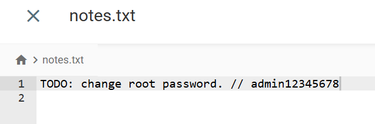

在/backup中发现一个.keep文件

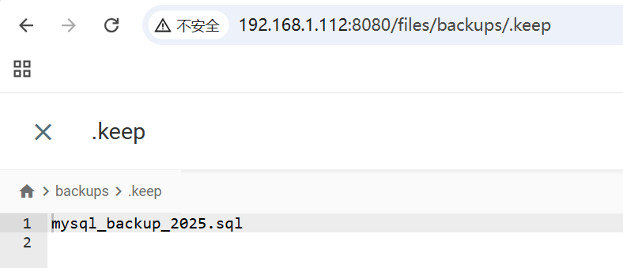

这个可以去访问一下看看，在8080端口中没找到，在80端口的服务中成功下载

``` sql
-- MySQL dump
-- Host: localhost    Database: testdb
-- ------------------------------------------------------
-- Server version 8.0.36
-- Username: fileadmin
-- Password: 1QOR4GKCNZzqC3nAQ41E

CREATE DATABASE IF NOT EXISTS testdb;
USE testdb;

DROP TABLE IF EXISTS user;
CREATE TABLE user (
    id INT PRIMARY KEY AUTO_INCREMENT,
    username VARCHAR(50),
    password VARCHAR(100)
) ENGINE=InnoDB DEFAULT CHARSET=utf8mb4;

INSERT INTO user (username, password) VALUES ('fileadmin', '1QOR4GKCNZzqC3nAQ41E');
```

暴露了数据库名`testdb`，用户名`fileadmin`，密码`1QOR4GKCNZzqC3nAQ41E`

成功登录，找到use.txt中的flag

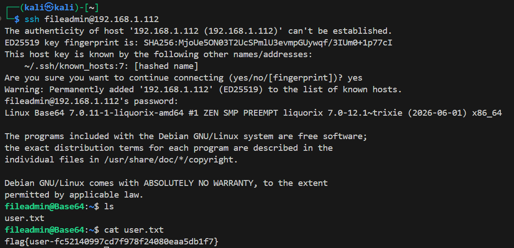

# 5. 利用filebrowser提权

接着尝试之前获得的root的密码`admin12345678`，使用ssh登录(虽然知道肯定会失败)

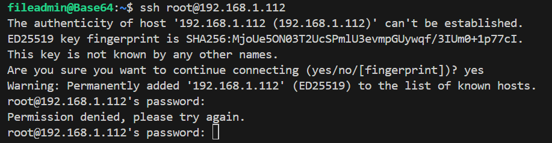

接着使用`sudo -l`查看当前用户的权限，发现fileadmin 可以免密以 root 身份执行 filebrowser

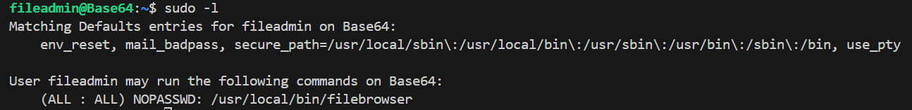

filebrowser是一个用Go语言编写的轻量级文件管理界面，常用于服务器运维，filebrowser可以指定数据库文件，且可以操作指定目录下的文件，那么只需要新建一个实例，再其指向根目录就能访问和修改所有文件了

让AI写一个启动命令，指向根目录，创建用户rootme / Passw0rd#1

``` bash
sudo /usr/local/bin/filebrowser -d /tmp/fb_$$.db -r / -a 0.0.0.0 -p 8899 --username rootme --password "$(sudo /usr/local/bin/filebrowser hash 'Passw0rd#1' | tail -1)" &
```

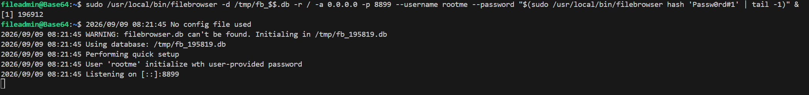

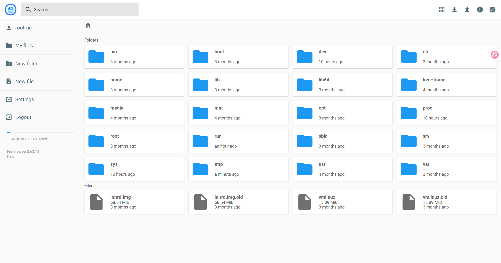

最后将自己的ssh公钥放到`/root/.ssh/authorized_keys`中，ssh登录获得flag和root shell

``` txt
ssh-ed25519 AAAAC3NzaC1lZDI1NTE5AAAAIJ89FxH2jPHHPSF8kAjoHLRW6qEuKkge0mYaMeqftDi4 2536996567@qq.com
```

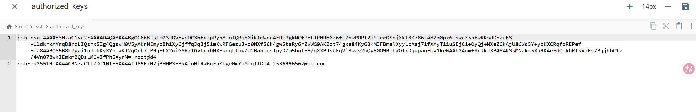

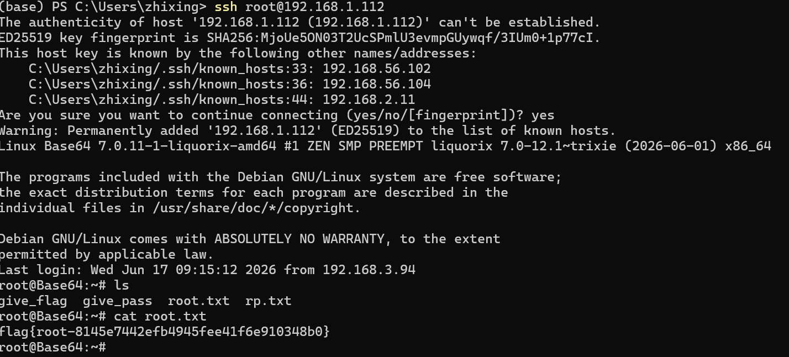