# Puzzle 靶机 WP

环境: kali linux

## 1. 端口扫描

``` bash 
nmap -Pn -p- -sV -sC -n 10.203.133.177
```

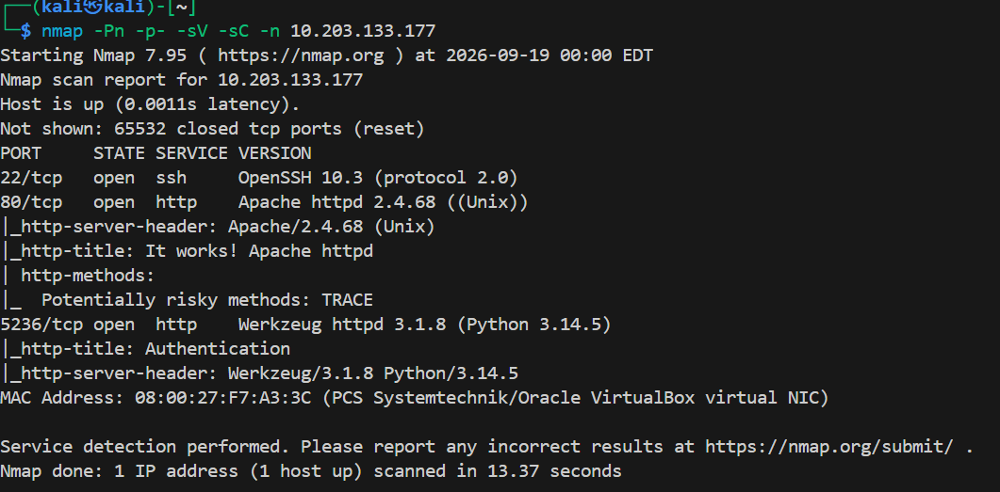

开放了80、5236端口，访问其web服务

## 2. 修改Host头访问/console

访问 80 端口，发现其为 Apache 默认页面，扫一下目录看看有没有隐藏东西

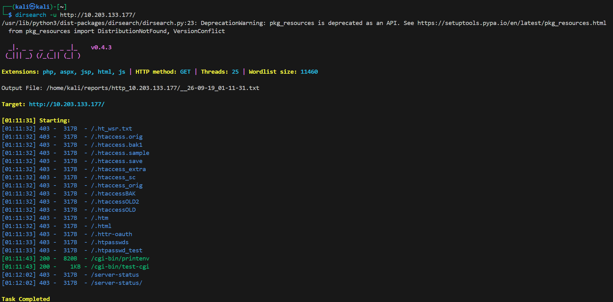

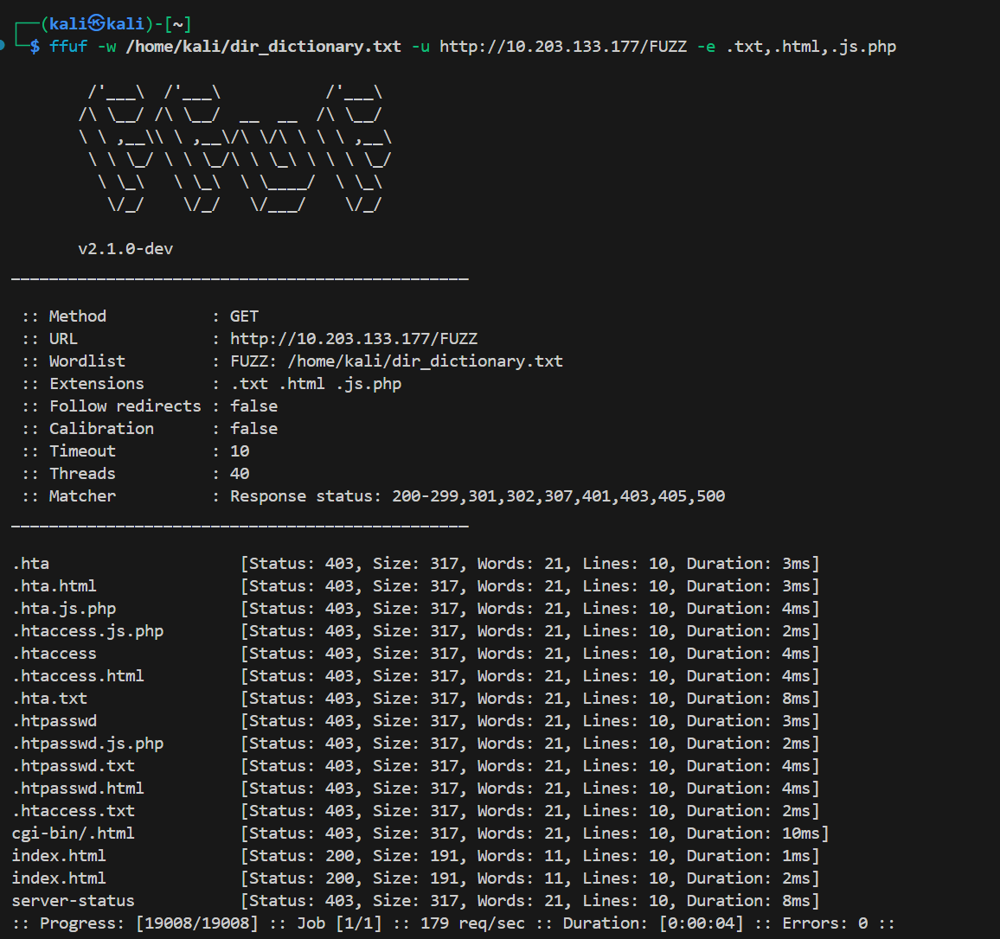

没什么发现，继续访问 5236 端口

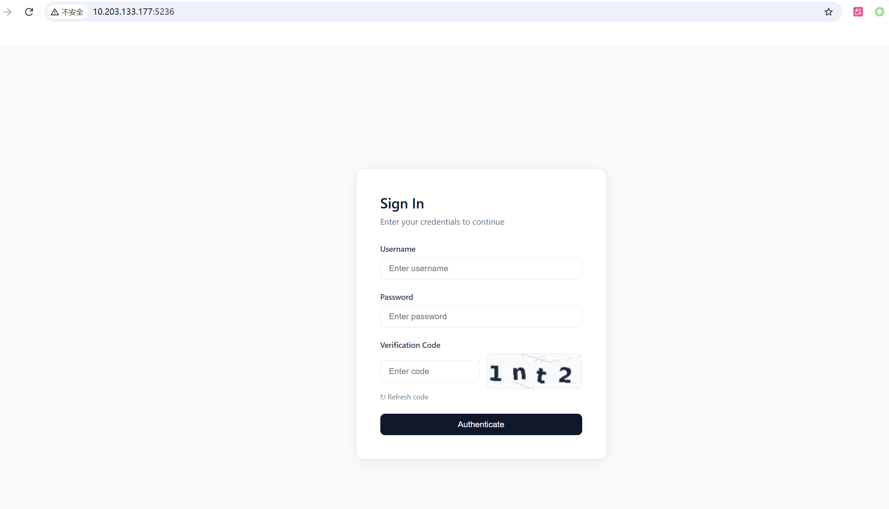

一个登录的界面，尝试了一些常见的弱口令密码，均失败，继续扫一下目录

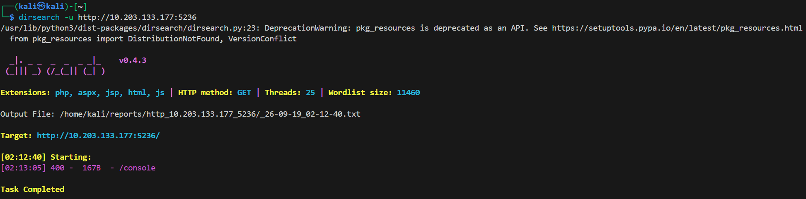

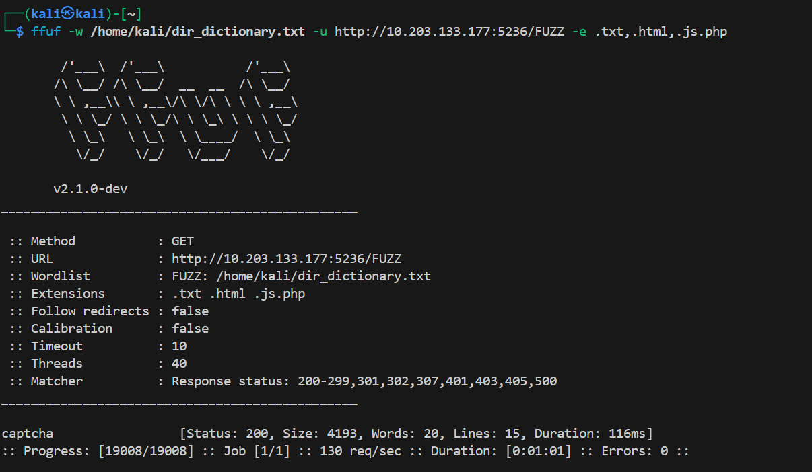

暴露了两个目录/console和/captcha，/console访问返回400的错误，说明其有访问限制，/captcha访问返回一个图片，看着像验证码

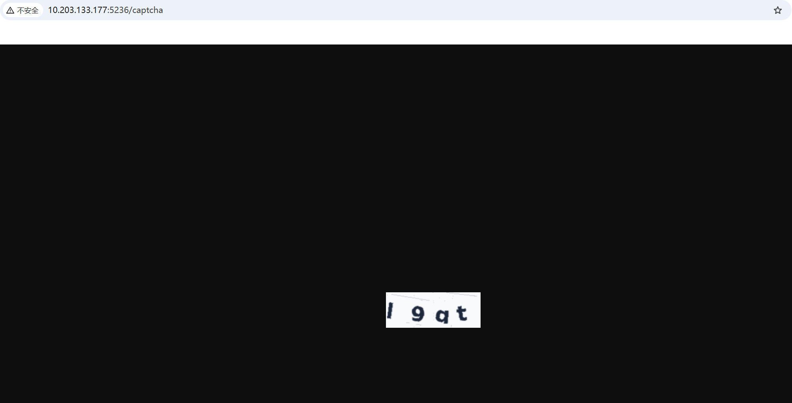

访问/console，抓包查看

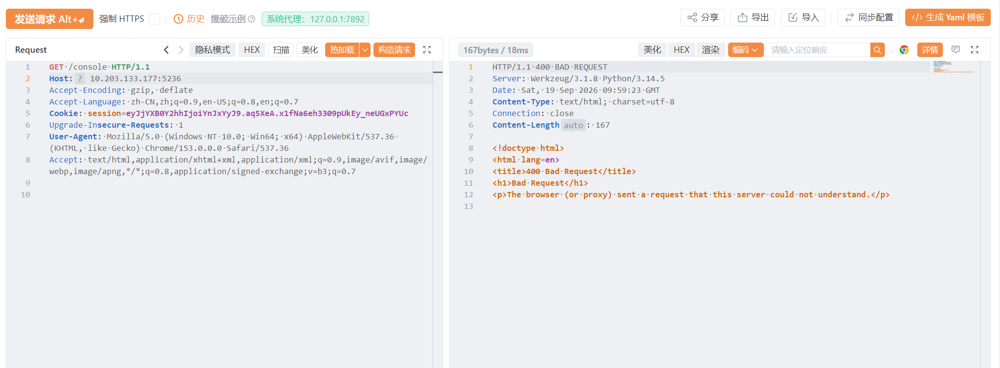

报错为浏览器或代理发了个服务器不能理解的请求，而Werkzeug 默认会检查 Host，尝试修改Host头指定 `localhost`：

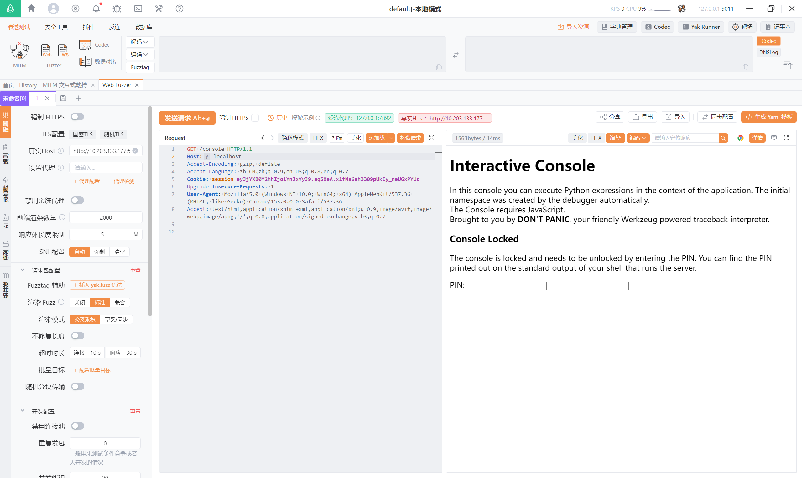

同时源代码中还泄露了一个SECRET：9Hmvs0Ika6l9Enmu2rnA

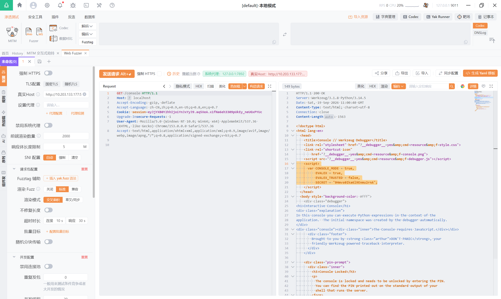

返回Interactive Console，可执行python表达式的控制台，不过目前是锁着的状态，需要PIN码才能解锁

## 3. 报错日志中出现PIN码

没什么线索，尝试从captcha目录找线索，在请求中发现captcha的参数可通过w、h、t传入

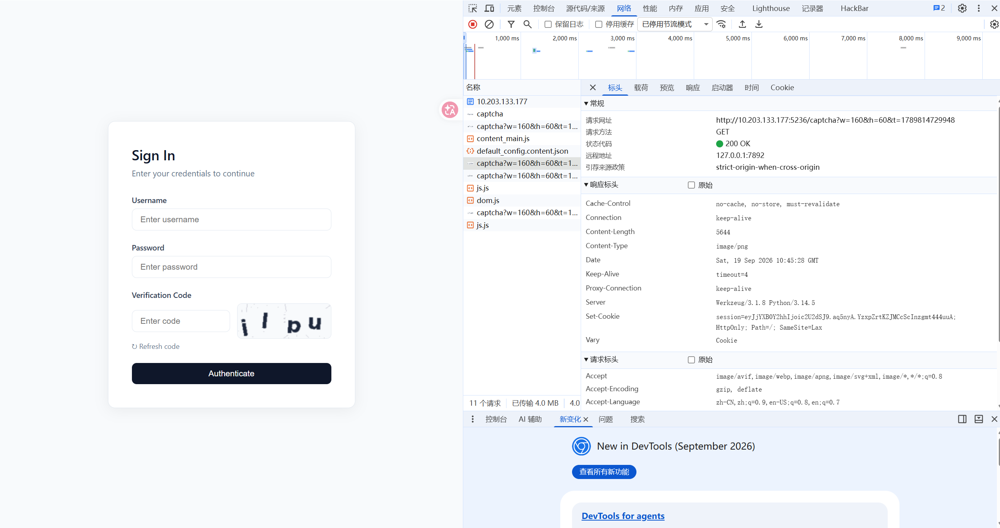

伪造一个大参数来尝试跑出异常，发现错误响应中包含最近的应用日志，日志中出现了PIN码103-462-340

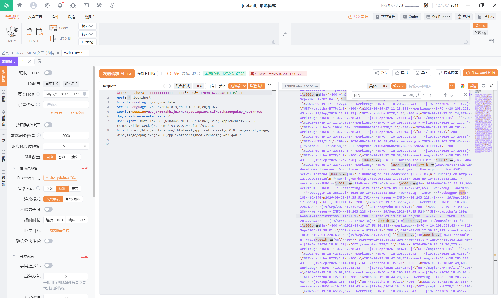

## 3. 认证debugger并执行python获取stardust的shell与flag

现在所需要的PIN码已经获取，根据搜索到的Werkzeug参数，使用PIN码和secret认证debugger

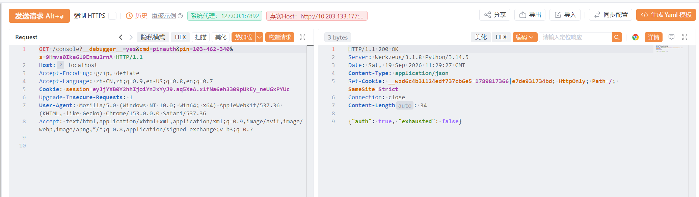

认证成功，将cookie复制过去再去修改cmd执行命令，frm参数设为0

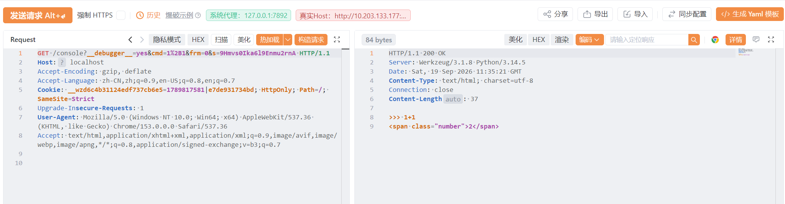

执行`__import__('os').popen('whoami').read()`查看当前用户，发现为stardust

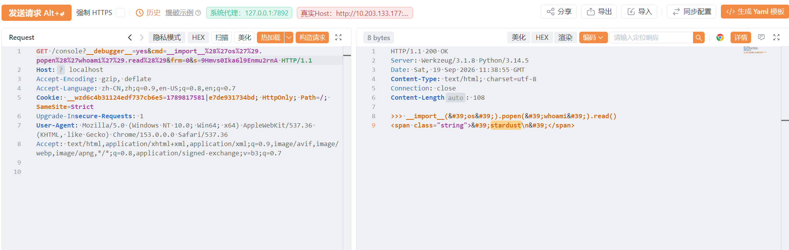

将我的ssh公钥写入

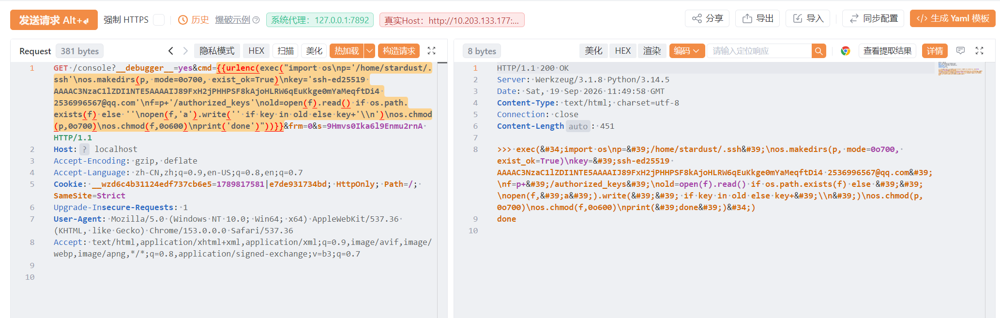

登录并读取flag

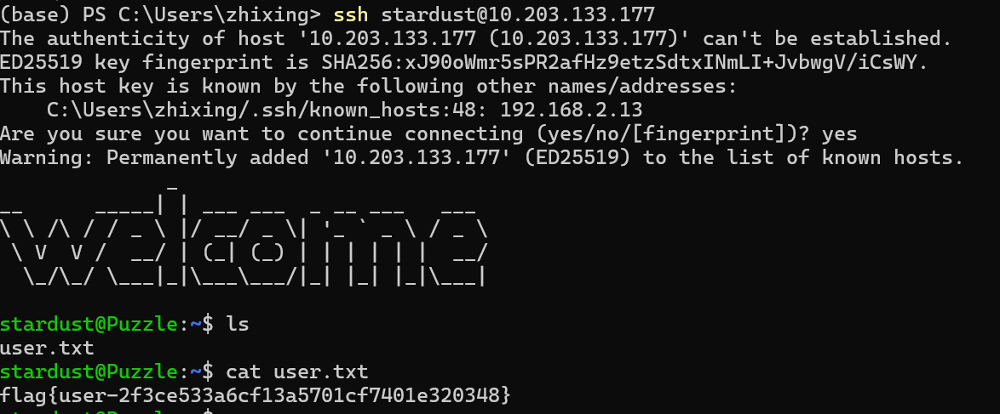

获取user的flag：flag{user-2f3ce533a6cf13a5701cf7401e320348}

## 4. 利用定时任务获取street用户shell并提权root

探索用户stardust终端的信息

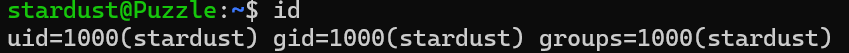

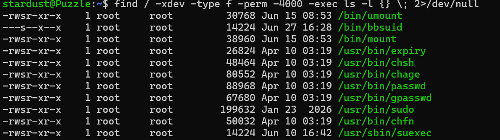

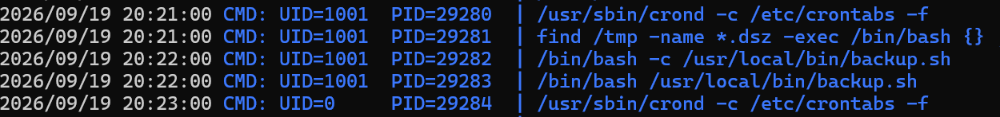

发现uid为1001的用户执行了一个定时任务，任务的脚本在`/usr/local/bin/backup.sh`中，查看该文件

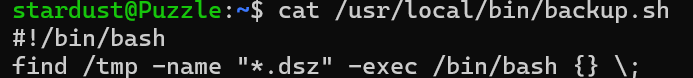

这个脚本会把 /tmp 下所有 .dsz 文件交给 Bash 执行，可以写个脚本将公钥写入该用户，不过在那之前先查看用户名，直接在/home下查看另一个用户，得知名为street

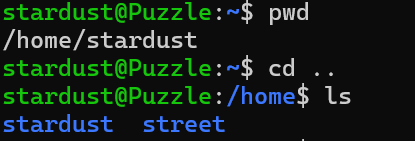

接着写脚本

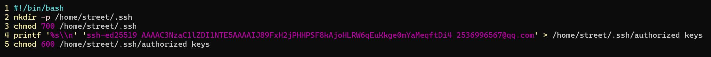

等待定时任务执行

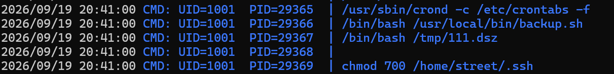

登录street

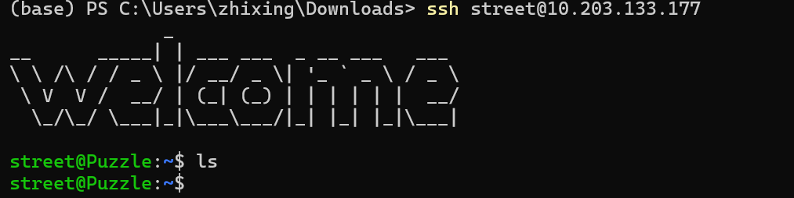

横向到street用户发现目录中直接ls没有东西，但是既然有线索指向了street用户，可以尝试查看street用户相关的文件，比如street所属的文件

使用find命令直接找

``` bash 
find / -xdev -user street 2>/dev/null
```

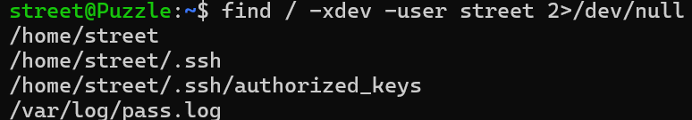

查看多出来的/var/log/pass.log文件，发现一串密钥hpUpTOvSt1D5JLA5

可以由文件名推测其可能是某个东西的密码，尝试使用该密码登录root用户，成功并获取到flag

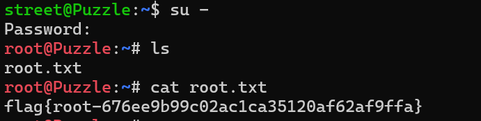

获取root的flag：flag{root-676ee9b99c02ac1ca35120af62af9ffa}